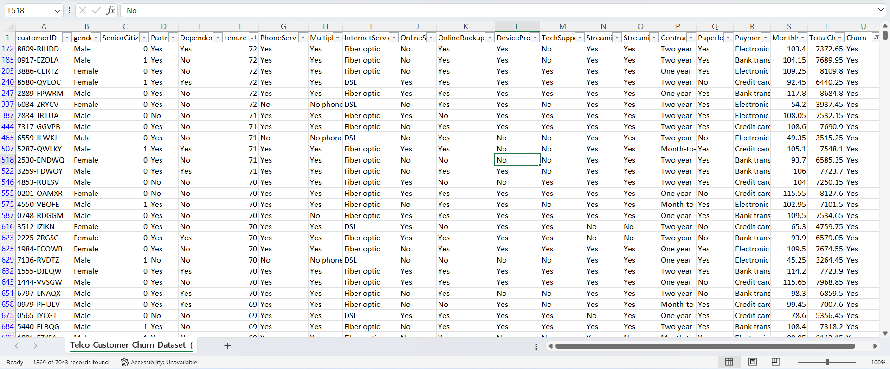
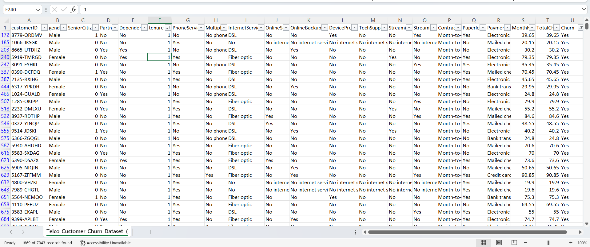
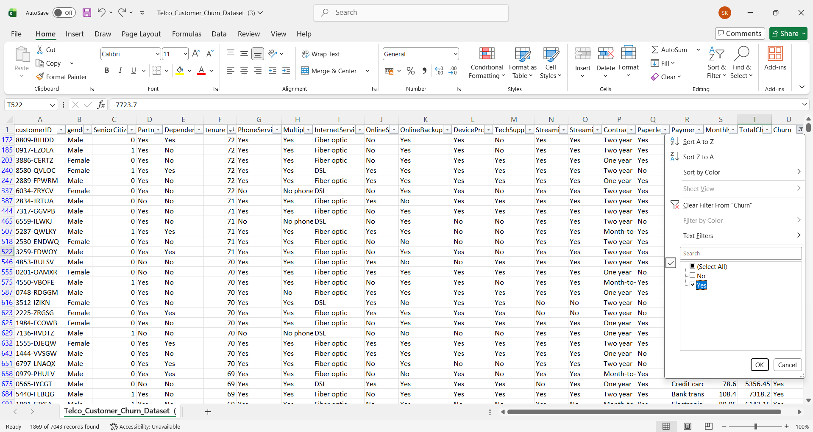

# Task 1: Data Overview and Simple Sorting

## Internship
SaiKet Systems – Business Analysis Internship

## Project Title
Customer Segmentation Visualization & Advanced Analysis

## Objective
The objective of this task is to understand the customer churn dataset, explore its structure, sort customer records based on tenure, and filter churned customers for basic analysis.

## Dataset
Telco Customer Churn Dataset

## Tools Used
- Microsoft Excel

## Steps Performed
1. Opened the Telco Customer Churn Dataset in Microsoft Excel.
2. Explored the dataset structure and customer information.
3. Sorted the **Tenure** column in ascending (Smallest to Largest) and descending (Largest to Smallest) order.
4. Applied a filter on the **Churn** column to display only customers with **Churn = Yes**.
5. Captured screenshots of the completed task.

## Visualization

### Tenure_Larger_to_Smaller

### Tenure_Smaller_to_Larger

### Churn_Filter_Yes

## Skills Learned
- Data Exploration
- Sorting Data
- Filtering Data
- Understanding Dataset Structure
- Microsoft Excel

## Outcome
Successfully explored the dataset, sorted customers based on tenure, and identified churned customers using Excel filters.

## Author
Sadhna Kumari