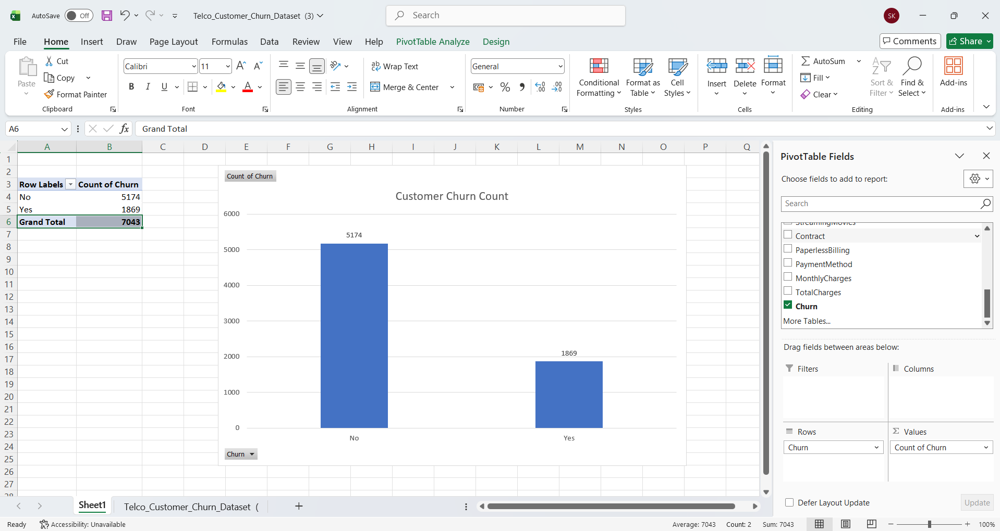

# Task 2: Churn Count Visualization

## Internship
SaiKet Systems – Business Analysis Internship

## Project Title
Customer Churn Count Visualization using Microsoft Excel

## Objective
The objective of this task is to analyze the customer churn data and visualize the number of customers who have churned and those who have not using a column chart.

## Dataset
Telco Customer Churn Dataset

## Tool Used
- Microsoft Excel

## Steps Performed
1. Opened the Telco Customer Churn Dataset in Microsoft Excel.
2. Created a Pivot Table using the Churn column.
3. Counted the number of customers with Churn = Yes and Churn = No.
4. Created a Clustered Column Chart to visualize the customer churn count.
5. Added a chart title and data labels for better visualization.
6. Captured screenshots of the Pivot Table and Column Chart.

## Key Findings
- Total Customers: 7043
- Churned Customers (Yes): 1869
- Non-Churned Customers (No): 5174
- The number of customers who did not churn is significantly higher than those who churned.

## Skills Learned
- Pivot Table
- Data Visualization
- Column Chart
- Microsoft Excel

## Files Included
- Telco_Customer_Churn_Dataset.xlsx
- README.md
- Screenshots/Churn_Count_Chart.png

## Screenshot

## Conclusion
The visualization clearly shows that most customers stayed with the company, while a smaller number of customers churned. This chart provides a quick understanding of the overall churn distribution.

## Author
Sadhna Kumari
