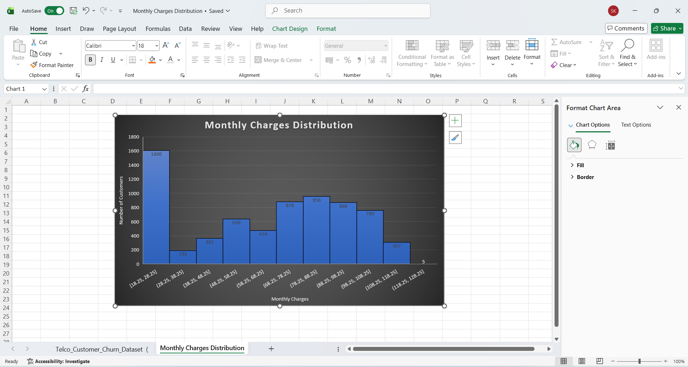

# Task 3: Monthly Charges Distribution

## Internship
SaiKet Systems – Business Analysis Internship

## Project Title
Monthly Charges Distribution Analysis using Microsoft Excel

## Objective
The objective of this task is to analyze the distribution of customers' monthly charges by creating a histogram. This helps understand how customer charges are spread across different ranges.

## Dataset
Telco Customer Churn Dataset

## Tool Used
- Microsoft Excel

## Steps Performed
1. Opened the Telco Customer Churn Dataset in Microsoft Excel.
2. Selected the MonthlyCharges column.
3. Created a Histogram chart to visualize the distribution of monthly charges.
4. Set the Bin Width to 10 for better grouping of data.
5. Added a chart title and axis titles.
6. Captured a screenshot of the final histogram.

## Key Findings
- The histogram shows the distribution of customers based on their monthly charges.
- Most customers are concentrated within specific monthly charge ranges.
- The chart helps identify the frequency of customers in different billing ranges.

## Skills Learned
- Histogram Chart
- Data Distribution Analysis
- Data Visualization
- Microsoft Excel

## Files Included
- Task3_Monthly_Charges_Distribution.xlsx
- README.md
- Screenshots/Monthly_Charges_Histogram.png

## Screenshot

## Conclusion
The histogram provides a clear visualization of how monthly charges are distributed among customers. It helps identify the most common billing ranges and supports further business analysis.

## Author
Sadhna Kumari  
