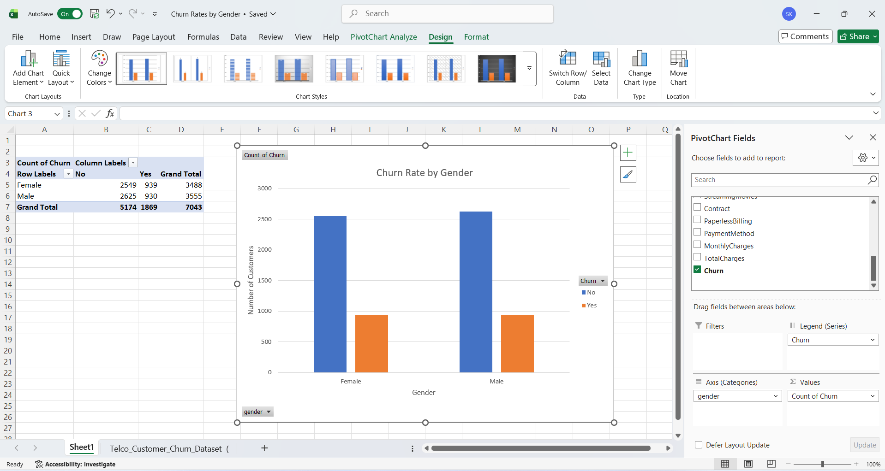

# Task 4: Churn Rate by Gender

## Internship
SaiKet Systems – Business Analysis Internship

## Project Title
Customer Churn Rate by Gender Analysis using Microsoft Excel

## Objective
The objective of this task is to compare customer churn between male and female customers using a Pivot Table and Clustered Column Chart.

## Dataset
Telco Customer Churn Dataset

## Tool Used
- Microsoft Excel

## Steps Performed
1. Opened the Telco Customer Churn Dataset in Microsoft Excel.
2. Created a Pivot Table.
3. Placed **Gender** in the Rows field.
4. Placed **Churn** in the Columns field.
5. Added **Churn** to the Values field and used the Count function.
6. Created a Clustered Column Chart from the Pivot Table.
7. Added a chart title, axis titles, and data labels.
8. Captured a screenshot of the final visualization.

## Key Findings
- The chart compares churn counts between male and female customers.
- Both churned (Yes) and non-churned (No) customers are displayed for each gender.
- The visualization helps identify whether gender has an impact on customer churn.

## Skills Learned
- Pivot Table
- Data Visualization
- Clustered Column Chart
- Customer Churn Analysis
- Microsoft Excel

## Files Included
- Task4_Churn_Rate_by_Gender.xlsx
- README.md
- Screenshots/Churn_Rate_by_Gender.png

## Screenshot

## Conclusion
This analysis provides a clear comparison of customer churn by gender. It helps understand the distribution of churned and non-churned customers across male and female groups, supporting better business decision-making.

## Author
Sadhna Kumari  
