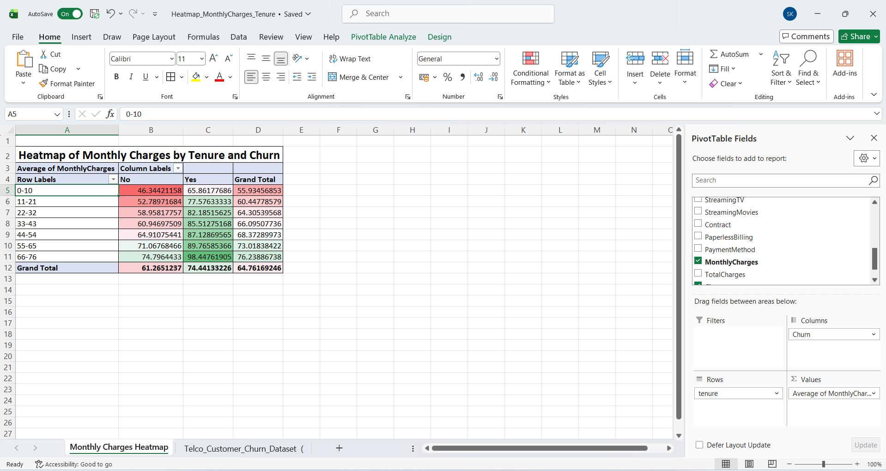

# Task 5: Heatmap for Monthly Charges and Tenure Interaction

## Internship
SaiKet Systems – Business Analysis Internship

## Project Title
Heatmap Analysis of Monthly Charges and Tenure using Microsoft Excel

## Objective
The objective of this task is to analyze the relationship between customer tenure, monthly charges, and churn behavior using a heatmap created with Conditional Formatting in Microsoft Excel.

## Dataset
Telco Customer Churn Dataset

## Tool Used
- Microsoft Excel

## Steps Performed
1. Opened the Telco Customer Churn Dataset in Microsoft Excel.
2. Created a Pivot Table from the dataset.
3. Added **Tenure** to the Rows field.
4. Added **Churn** to the Columns field.
5. Added **MonthlyCharges** to the Values field and changed the calculation to **Average**.
6. Applied **Conditional Formatting → Color Scales** to create a heatmap.
7. Added a title to the worksheet.
8. Captured a screenshot of the final heatmap.

## Key Findings
- The heatmap highlights the relationship between customer tenure and monthly charges.
- Color intensity helps identify higher and lower average monthly charges.
- The analysis makes it easier to observe churn behavior across different tenure groups.

## Skills Learned
- Pivot Table
- Conditional Formatting
- Heatmap Creation
- Data Visualization
- Churn Analysis
- Microsoft Excel

## Files Included
- Task5_Heatmap_MonthlyCharges_Tenure.xlsx
- README.md
- Screenshots/Heatmap_MonthlyCharges_Tenure.png

## Screenshot

## Conclusion
The heatmap provides a clear visual representation of how average monthly charges vary across customer tenure and churn categories. It helps identify patterns and supports better business decision-making through effective data visualization.

## Author
Sadhna Kumari  
